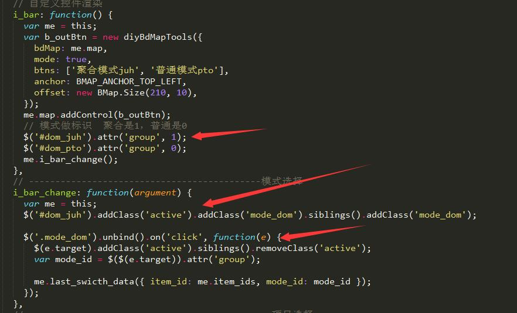
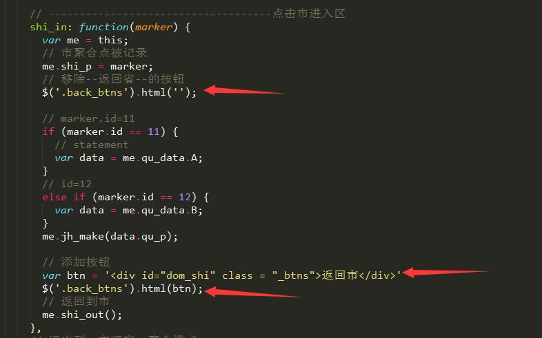
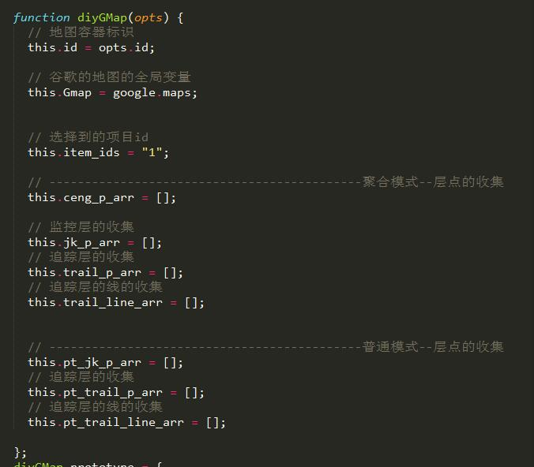
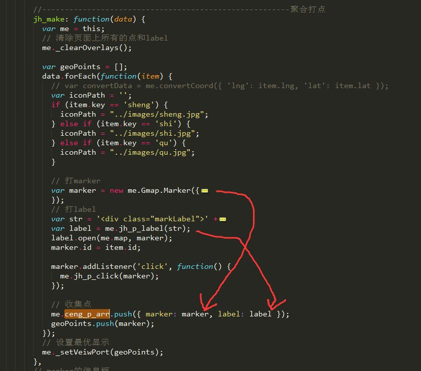
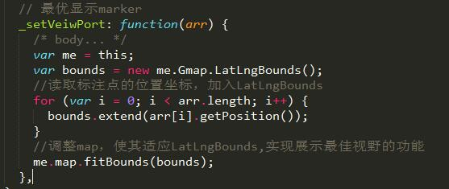

#【四】Google_items_moniter google地图--后台聚合数据~c~

### 1.运行

```
* $ git pull
* $ gulp;
```

### 2.项目说明

* 此项目是 [区监控--实时追踪](https://zc3hd.github.io/demo_Google_map_moniter_qu/) 的拓展模块，参照[省市区、监控、追踪5层数据，baidu模式](https://zc3hd.github.io/demo_BDmap_noWeb_clus/)的代码写法敲出的google版。
* 很多地方和baidu模式极其相似，因为这个项目涉及到地图模式的转换，最好代码风格保持一致。

#### 2.1 控件栏渲染

* 首先进入页面是，项目控件栏（选择不同的项目），模式控件栏（聚合模式、普通模式）进行渲染。选择不同的项目，进行不同项目的渲染。
* 直接说不同的地方吧，百度的自定义控件渲染时同步的，但是google这个控件自定义渲染尽然是异步。以至于我在一开始默认它是同步的，想给渲染的dom绑定属性和事件竟然特么的绑定不上去。(=@__@=)？
* baidu：自定义控件渲染为同步，属性和事件绑定都在渲染后进行。



* google：自定义控件渲染为异步，迫使我把需要的属性绑定在渲染控件这个面向对象的内部了，这种写法其实很打脸。绑定事件也是在body上通过事件委托进行绑定


* google自定义控件面向对象修改：


#### 2.2 HTML渲染控件

* 接下来用页面上写标签的方式，写完这个项目感觉其实这样的写法还是很不错，不仅不需要记录每次生成的按钮，dom操作无形中给生成和清除都特别方便。




#### 2.3 收集各层数据

* 为什么要收集各层数据，还是归结到googleMap最大坑的地方，不自带获取地图全部覆盖物，不能清除页面所有覆盖物。
* 构造函数的内部创建写各层数据的收集容器，作用是用于清除。



* 收集是把marker和label一起收集，因为google清除marker的同时还得清除label。变不变态，嘿嘿。



#### 2.4 _clearOverlays：

* 自己写清除地图上所有的覆盖物


#### 2.5 _setVeiwPort：

* 自己写最优显示所有点



#### 2.6 收集轨迹线：

* 轨迹线也要作为marker进行收集：


### 3.思路及注意

* 聚合一层一层的进入和退出是难点。和百度一样。建议先进行百度地图同样模块的学习。
* google的自定义控件渲染时异步的。改变思路，写在HTML上操作DOM感觉还不错。
* 没有相应API的时候，试着自己造出来它！google这里的_clearOverlays和_setVeiwPort都是自己造的，类似百度的同样的API。反正相互适应，相互抄袭吧。
* 写业务需求的时候可以先在纸上把流程跑一遍，这样到了关键的地方，需要记录什么关键的obj和属性，心里有数，深层次的编辑也不会错。思维而且特别清楚。
* 附一张我简单的流程图，圆圈表示在某一层的数据，旁边的方框代表需要退到上一层的返回按钮。这样我就很清楚我到了哪层怎么写。


 
